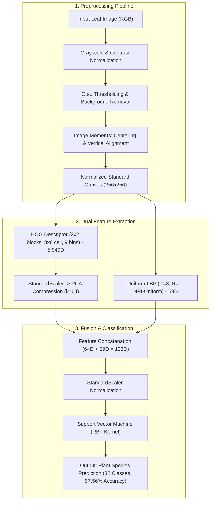

# Leaf Classification with HOG, LBP, and SVM

Traditional computer vision pipeline for classifying plant leaf images across 32 species using the Flavia dataset.

---

## 🏗️ Method & Pipeline Architecture



---

## Features

- Otsu segmentation, moment-based vertical alignment, and centroid centering
- HOG (Histogram of Oriented Gradients) feature extraction with 2x2 blocks (5,940D)
- Uniform LBP (Local Binary Patterns) histogram extraction (59D)
- PCA dimensionality reduction for HOG feature optimization (k=64)
- Feature fusion (HOG PCA + LBP = 123D) with RBF-SVM classification
- Hyperparameter tuning and model evaluation across feature sets

## Requirements

- Python 3.10+
- Dependencies listed in `requirements.txt`

## Setup

Create and activate a virtual environment.

Windows PowerShell:

```powershell
py -m venv .venv
.\.venv\Scripts\Activate.ps1

pip install -r requirements.txt
```

## Dataset

Download the Flavia Leaf Image Dataset from the [official project page](https://flavia.sourceforge.net/).

Extract the image files into:

```text
data/raw/Flavia/
```

Expected structure:

```text
data/raw/Flavia/
├── 1001.jpg
├── 1002.jpg
└── ...
```

## Usage

Run all commands from the `leaf_hog_lbp_svm` directory.

### 1. Label Generation & Data Splitting
```powershell
# Option A: Full 32-class dataset (default)
python -m src.make_labels --num-classes 32

# Option B: 10-class baseline experiment
python -m src.make_labels --num-classes 10

# Perform stratified 70/15/15 train/val/test splitting
python -m src.split_data

# Find optimal PCA dimension k
python -m src.select_k_pca

# Train feature configurations
python -m src.train --feature-set hog
python -m src.train --feature-set lbp
python -m src.train --feature-set hog_pca_lbp

# Refit the selected model and evaluate on the test split
python -m src.evaluate --feature-set hog_pca_lbp
```

## Project Structure

```text
.
├── data/           # Dataset metadata and splits
├── experiments/    # SOTA reproduction modules (Sulc & Matas ECCV 2014)
│   └── sulc_matas/
├── models/         # Trained model artifacts
├── results/        # Metrics, figures, and predictions
├── src/            # Source code
└── requirements.txt
```